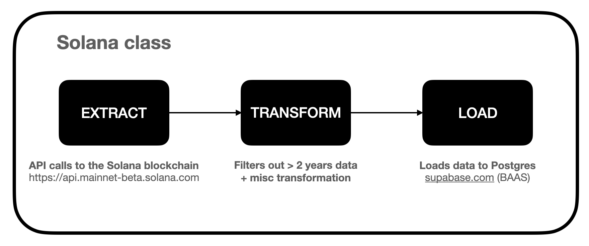
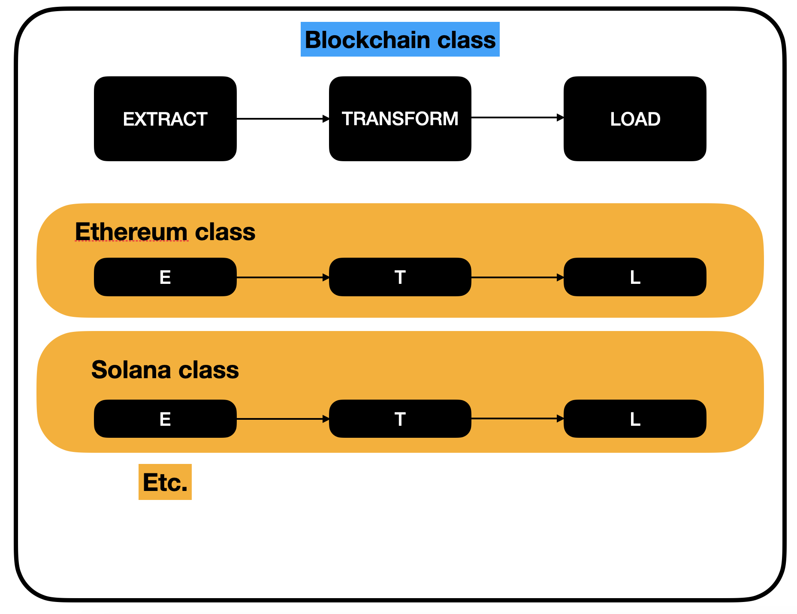

# Collaboration and documentation

## How does the ETL program work?

### What does it do?

This program essentially does three things:
- it extracts data from the Solana blockchain
- then transforms the data according to the assignment rules
- and loads the data to Postgres

### How to launch it?

You execute it by running the following command in a MacOS or Linux terminal at the root of the project:
```
python main.py blockchain Solana <MINT_KEY>
```

Example: 
```
python main.py blockchain Solana Gjx4wAMi7QUriRqXpjKydb2MJ3qzxHX9yeaj4DHQNJnh
```

Internally it instantiates the Solana class (see command line), defined in the code [here](./blockchain/solana/solana.py), for mint address `Gjx4wAMi7QUriRqXpjKydb2MJ3qzxHX9yeaj4DHQNJnh`. The mint address was directly taken from a random Magic Eden NFT.

The Solana class contains three methods that are specific to Solana data:
- Extract: the extract method first calls the getSignaturesForAddress endpoint (from the Solana API) to get signatures for confirmed transactions. Once I have these signatures, I call the getTransaction endpoint for each signature to get transaction details for a confirmed transaction.
- Transform: the transform method applies the business rules described in the assignment and creates handy columns later used in Postgres
- Load: the load method writes the data raw_transaction table in Postgres (Supabase)



### ETL Architecture

#### Overview

By utilizing the Abstract Base Classes (ABC) library in Python, I've designed a hierarchical class structure to ensure a consistent Extract, Transform, Load (ETL) framework for all newly acquired data from any blockchain. In essence, I've defined a superclass named 'Blockchain' from which individual blockchain classes such as 'Solana' inherit. This superclass incorporates three core methods: extract, transform, and load. This design guarantees that every subclass, like 'Solana', is required to implement these three methods. Python will generate an error if any of these methods are overlooked. This approach is highly effective in implementing a robust ETL structure across all classes.



The purpose of this design is to enable a secure and systematic scalability of the number of blockchain classes, such as expanding the ETL process for additional blockchains, without compromising stability or efficiency.

#### Expandable to other APIs

Moreover, through the development of the `currency` module, I aimed to illustrate that this technique is not limited to blockchain data alone and can be incorporated into the same project to handle diverse data types. Indeed, given that several methods, specifically `make_request`, are generic enough to invoke API endpoints, this project is adaptable for fetching data from other APIs.

#### Choice of stack

##### Extraction

I utilized the renowned Python requests package to retrieve data from APIs during the extraction process. This package has a long-standing presence and has been extensively tested in various scenarios. Additionally, I employed the tenacity Python library to enhance the reliability of HTTP requests.

##### Transformation & Loading

I selected PySpark because its API is sturdy and ideal for conducting in-memory data transformations, and it also excels at handling large volumes of data.

##### Database (hypothetical choice - I could be wrong here)

I opted for Supabase, a well-regarded Backend as a Service (BAAS), for a couple of key reasons:
- First, from my conversation with Pierre, it seems evident that LLAVA aims to progress quickly and explore various markets and opportunities. Therefore, it appeared beneficial, particularly in the initial stages, to devote our efforts to data exploration rather than managing an entire Postgres server.
- Secondly, my understanding is that LLAVA might consider venturing into the creation of a Software as a Service (SAAS) for NFTs. Supabase is an excellent choice for such a venture, as all tables can be accessed easily through a Supabase client, which can be readily integrated with frontend tools like NextJS and Flutter.

## What is happening in Postgres

In Postgres, I created a few functions that clean and aggregate the results on the fly.

More precisely what I did is:
- created stage_transition and enforced a PK on the transaction id. What it does essentially is define a unique identifier for each row and remove the duplicates based on this row. It is triggered whenever new rows are inserted to raw_transition
- created agg_weekly_user that generates the number of active users weekly. It is triggered whenever new rows are inserted to stage_transition
- created agg_weekly_user that counts the distinct number of transactions per program called. It is triggered whenever new rows are inserted to stage_transition

Since these tables are created as soon as new data arrive in Postgres, the aggregated data are immediately available (minus the SQL query time < 10 sec).

## Web Dashboard 

I've swiftly developed a basic web dashboard utilizing Flutter and Supabase. 
The data can be viewed [here](https://app.cvbuilderai.com/solana). 
The dashboard reflects changes instantaneously as new data gets loaded into Postgres.
It pulls information from the aggregated tables as mentioned in the preceding Postgres section.

I chose to do this using Flutter over Retool since:
- I know Flutter quickly well and creating a dashboard with it is fast and easy
- I thought it could be useful to know, we potentially have the possibility to create a custom dashboard for customers

## Collaboration with other teams

Here is what I would do:

- Regular Meetings: I'd initiate frequent discussions with the data science and business teams. This would allow us to understand their data needs and how they intend to use it, making our interactions less transactional and more collaborative.
- Understand Technical Aspects: we'd delve into technical requirements, discussing specifics like the frequency of data updates, delivery preferences, and data quality rules.
- Implement Changes: based on our discussions, I'd work on adjusting the ETL pipeline to match their needs. This could involve refining our data extraction, transformation, or loading processes.
- Test and Gather Feedback: post adjustments, I'd conduct thorough testing and then invite the teams to use it. Their feedback would be crucial in ensuring that the adjustments meet their needs effectively.
- Document Changes: to maintain transparency and clarity, I'd document all changes made to the pipeline and explain how to best utilize the updated setup.
- Continuous Communication: finally, I'd keep the dialogue open. As their data needs evolve over time, I'd ensure our ETL pipeline adapts to those changes.

This approach would ensure our ETL pipeline continues to serve the needs of our data science and business teams effectively.
