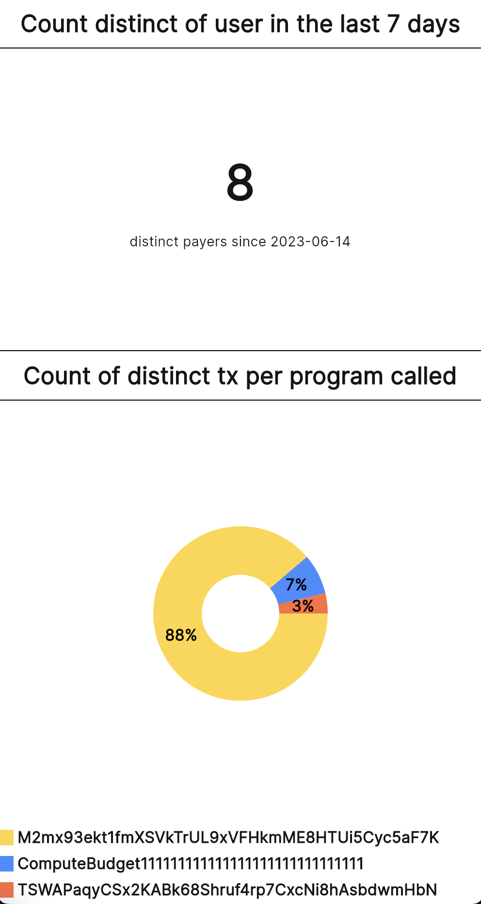

# Welcome to my LLAVA blockchain etl

I am Loïc, currently working out of Durham, UK.

Here is my take on the assignment aiming to fetch data from the Solana blockchain. You will find most of the code in the main.py, the blockchain module and utils.py.

## tldr: How to execute the code & see the results
To run the ETL (it is also explained in the [collaboration.md](collaboration.md)) just type at the root of the project from a MacOS or Linux terminal:
```
python main.py blockchain Solana <MINT_KEY>
```

Example with mint key `CqR9VaK9GQhLqGdf9ZTGpt9vMZ1zEfztKzab2iy1TNzU` from this [Okay Bear NFT](https://magiceden.io/item-details/CqR9VaK9GQhLqGdf9ZTGpt9vMZ1zEfztKzab2iy1TNzU?name=Okay-Bear-%23445)

```
python main.py blockchain Solana CqR9VaK9GQhLqGdf9ZTGpt9vMZ1zEfztKzab2iy1TNzU
```

You can see the realtime data [here](https://app.cvbuilderai.com/solana):



Note: I created a temporary screen in my application [CVBuilderAI](https://app.cvbuilderai.com/)

## The rest of the assignment
Also you will find:

- Part 2 of the assignment is here -> [optimization.md](optimization.md) (eg. how to optimize & troubleshoot it)
- Part 3 of the assignment is here -> [collaboration.md](collaboration.md) (eg. how the ETL works & collaborations)

## Greetings
Thank you for giving me the opportunity to dive into the blockchain data.
I enjoyed doing so 🤩 

